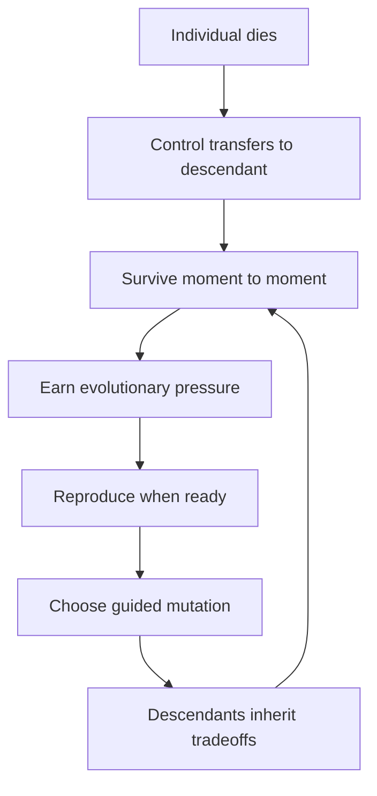

# EvolutionSimGame Project Plan

## Current State

The repo is at **seed stage**: documentation and agent tooling only. No Swift package, Xcode project, tests, or simulation code exist yet. Source of truth: [README.md](README.md), [AGENTS.md](AGENTS.md), and [docs/game-design.md](docs/game-design.md).

**Product goal:** A native Apple-platform evolution simulator where the player guides a **lineage** from single-cell organism to adapted forms through survival, reproduction, and contextual mutation choices.

**Core loop** (from game design):

## Design Pillars (Non-Negotiable)

These constrain every phase:

- **Visible evolution** — trait changes affect movement, senses, diet, defenses, and habitat access observably
- **Meaningful tradeoffs** — every adaptation has a cost (e.g., fins vs land mobility)
- **Terrain-driven strategy** — biomes create pressure, not hard walls
- **Lineage over individual** — death is consequential but not game-over if reproduction succeeded
- **Game clarity over realism** — simple, understandable biology

## Architectural Invariants

From [AGENTS.md](AGENTS.md), enforced from Phase 0 onward:

- Simulation core testable without UI (`EvolutionSimCore` Swift package, no SwiftUI/UIKit imports)
- Seeded deterministic randomness; explicit fixed time steps (not frame-rate dependent)
- Serializable world/organism state for tests, replay, and future saves
- Clear boundaries: sim / rendering / input / UI / persistence
- Performance-aware for iPhone and iPad, not only Mac

## Key Decisions (Resolved)

| Decision | Choice | Implication |
|----------|--------|-------------|
| MVP playtest platform | **iPad-first** | Adaptive side panels, pointer, and keyboard are the design center; iPhone compacts from iPad layout; macOS extends with desktop affordances |
| World representation | **Continuous 2D** | Floating-point positions, radius-based collision, terrain sampling at coordinates; spatial indexing (e.g., uniform grid) for predators/food queries |
| Rendering (Phase 0 spike) | **Decide in Phase 0** | UI specialist compares SwiftUI Canvas vs SpriteKit; choose based on iPad performance + sim snapshot adapter simplicity |
| MVP persistence | **In-memory + seed replay** | No save UI in MVP; seed + step API enables deterministic replay and balancing |

## MVP Scope Boundary

Smallest playable version that proves "evolution through survival choices" ([docs/game-design.md](docs/game-design.md) Recommended MVP):

| In scope | Out of scope (post-MVP) |
|----------|-------------------------|
| 2D top-down continuous world | Full era progression (Primordial → Ecosystem Dominance) |
| One controllable single-cell organism | All 8 trait categories and body plans |
| Food particles + simple predators | Rival species, climate shifts, extinction events |
| Energy, health, reproduction | Cloud, multiplayer, accounts, analytics |
| 3 terrain types: water, mud, toxic pool | Full biome set (forest, desert, tundra, etc.) |
| 6–10 traits with tradeoffs | Scientific-grade biological modeling |
| Reproduction → descendants → mutation choice | Population autonomy at scale |
| Basic fitness + lineage summary | Save/load UI |

**Initial trait set (MVP):** speed, size, armor, toxin resistance, swim efficiency, reproduction rate, sense radius, metabolism.

## Phase Overview

---

## Phase 0 — Foundation and Scaffold

**Goal:** Buildable native Apple project with a testable, UI-free simulation package.

**Deliverables:**

- Swift Package `EvolutionSimCore` (or equivalent) — zero UI dependencies
- Multi-target Xcode app shell: macOS + iOS/iPadOS (shared app structure, platform-specific entry/layout hooks)
- Seeded RNG + fixed-timestep tick loop skeleton
- Continuous 2D world model: bounds, coordinate types, entity IDs, snapshot serialization
- Rendering technology decision record (Canvas vs SpriteKit) with rationale
- [README.md](README.md) updated with build/test commands

**Acceptance criteria:**

- `swift test` passes in `EvolutionSimCore`
- Xcode builds for iPad simulator and macOS
- Deterministic test: same seed + N ticks → identical serialized state
- Snapshot round-trip test (encode/decode world state)

**Primary agent:** `/evolution-simulation-gameplay-specialist`  
**Supporting:** `/evolution-apple-platform-ui-specialist` (app shell, rendering spike)  
**Verify:** `/evolution-verifier` (`swift test`, build smoke)

**Risks:** Over-scaffolding before first mechanic; premature rendering lock-in. **Mitigation:** Spike only; sim package stays renderer-agnostic via snapshot adapter.

---

## Phase 1 — Core Simulation (Headless MVP Mechanics)

**Goal:** Complete MVP simulation logic with no rendering.

**Deliverables (one mechanic at a time, each tested before the next):**

1. **Organism model** — position, velocity, radius, energy, health, age; movement with energy cost
2. **Terrain system** — continuous sampling for water/mud/toxic; compatibility penalties (speed, energy drain, damage)
3. **Food** — spawned particles; consumption and energy gain
4. **Predators** — simple chase AI; health damage; flee behavior driven by sense radius trait
5. **Traits (6–10)** — explicit stat modifiers with tradeoffs; inherited on reproduction
6. **Reproduction** — energy threshold + safe-site check; offspring with inherited traits + small variance
7. **Mutation choice** — post-reproduction, pick 1 of 3 options; deterministic application
8. **Lineage handoff** — on player organism death, control transfers to a living descendant
9. **Fitness metrics** — survival time, offspring count, food efficiency, biomes explored, predator avoidance

**Acceptance criteria:**

- Unit tests cover: starvation, predator kill, terrain penalties, reproduction gate, trait inheritance, mutation application, lineage handoff, extinction (no descendants)
- Seeded replay: full session reproducible from seed + input log
- No UI imports in simulation package

**Primary agent:** `/evolution-simulation-gameplay-specialist`  
**Verify:** `/evolution-verifier` (determinism suite, edge cases)  
**Review:** `/evolution-code-reviewer` (architecture boundaries, scope)

**Risks:** Trait combinatorics; non-deterministic predator behavior. **Mitigation:** Cap traits at MVP set; fixed tick order; seeded AI decisions.

---

## Phase 2 — Gameplay Loop Integration

**Goal:** Close the evolution loop in simulation state; prepare stable API for UI.

**Deliverables:**

- **Evolutionary pressure points** — accumulated from survival events (water exposure, predator near-misses, food scarcity, exploration)
- **Contextual mutation offers** — pressure history biases the 3-option pool (e.g., repeated water → fin/gill/skin/generalized)
- **Descendant population** — semi-autonomous NPC descendants (bounded count, simple wander/forage); player selects representative
- **Sim control API** — pause, step, speed multiplier, reset, seed input, player movement intent
- **Centralized tuning constants** — balancing values in one module

**Acceptance criteria:**

- Tests: pressure history changes mutation offers; population capped; replay from seed + inputs matches
- Sim API documented (types consumed by UI layer)
- Performance note: N descendants at fixed tick rate on iPad-class hardware (headless benchmark)

**Primary agent:** `/evolution-simulation-gameplay-specialist`  
**Verify:** `/evolution-verifier` (pressure→mutation linkage, population bounds, replay)

**Defer:** Era transitions, climate, rival species, mass extinction events.

---

## Phase 3 — UI and Rendering (iPad MVP Playable)

**Goal:** First human-playable build; **iPad is the primary playtest target.**

**Deliverables:**

- 2D top-down view rendering sim snapshots (terrain, food, predators, player organism, descendants)
- **iPad layout:** simulation primary; side inspector panel; bottom or radial movement controls; pointer + keyboard shortcuts where natural
- **iPhone layout:** compact HUD and controls derived from iPad design (not a separate product)
- **macOS layout:** extend iPad with menus, toolbar, keyboard commands
- HUD: energy, health, reproduction readiness
- Mutation choice UI at reproduction milestone
- Pause / speed / reset / seed controls
- Inspector: traits, stats, biome compatibility, lineage summary
- Clean sim↔UI boundary: views read immutable snapshots; input forwarded as intents

**Acceptance criteria:**

- Playable session on iPad simulator: move, eat, flee predator, reproduce, choose mutation, die and continue as descendant
- Builds succeed for iPad, iPhone, and macOS targets
- No simulation logic in SwiftUI views
- Touch targets readable on iPhone minimum width

**Primary agent:** `/evolution-apple-platform-ui-specialist`  
**Supporting:** `/evolution-simulation-gameplay-specialist` (API gaps only)  
**Verify:** `/evolution-verifier` (multi-target build, iPad simulator smoke, input flow)

**This phase is the first fun/playtest gate.** Do not expand content until the loop feels understandable on iPad.

---

## Phase 4 — Debug, Inspectability, and Platform Polish

**Goal:** Make evolution legible; differentiate platforms per [AGENTS.md](AGENTS.md).

**Deliverables:**

- Toggleable debug overlays: food density, danger zones, terrain cost, lineage state
- Selected-organism detail with player-facing trait explanations
- iPad: adaptive panels, pointer hover, keyboard shortcuts
- macOS: menus, commands, toolbar, inspector window pattern
- Accessibility labels and UI test identifiers on key controls
- iPhone performance baseline with MVP population

**Acceptance criteria:**

- Overlays toggle without obscuring primary sim view
- VoiceOver reads core controls on iPad
- Stable update rate on iPhone with MVP population cap

**Primary agent:** `/evolution-apple-platform-ui-specialist`  
**Verify:** `/evolution-verifier` (per-platform builds, a11y spot-check, performance note)

---

## Phase 5 — Content Expansion and Progression (Post-MVP)

**Goal:** Grow toward full [docs/game-design.md](docs/game-design.md) vision after MVP playtest validation.

**Deliverables (sequenced, not bundled):**

1. **Era 1–2:** Primordial Pool, Reef/Shallows — new pressures, resources, predators
2. **Expanded terrain:** forest, swamp, desert, tundra, mountain, ice, toxic zones with compatibility matrix
3. **Expanded traits:** senses, social behavior, reproduction strategy categories (one category at a time)
4. **Victory goals:** pick 1–2 initially (e.g., survive mass extinction, spread to all major biomes)
5. **Optional save/snapshot:** seed + world state restore

**Acceptance criteria per increment:** New content has deterministic tests; trait effects observable in UI; no regression to MVP replay tests.

**Primary agents:** `/evolution-simulation-gameplay-specialist` + `/evolution-apple-platform-ui-specialist`  
**Verify:** `/evolution-verifier` after each content increment

---

## Explicitly Deferred

Do not plan or implement unless explicitly requested:

- Cloud backend, accounts, auth, analytics, payments, networking
- Multiplayer / shared online worlds
- Non-Apple platforms
- Full 8-category trait tree, all terrains, all eras before MVP playtest
- Broad engine/framework changes without a decision record

---

## Agent Handoff Matrix

| Phase | Primary | Support | Verification |
|-------|---------|---------|--------------|
| 0 Foundation | Simulation specialist | UI specialist (shell + render spike) | Verifier: `swift test`, builds |
| 1 Core Sim | Simulation specialist | — | Verifier: determinism, edge cases |
| 2 Gameplay Loop | Simulation specialist | — | Verifier: pressure→mutation, replay |
| 3 UI (iPad MVP) | UI specialist | Simulation specialist (API) | Verifier: iPad smoke, multi-target |
| 4 Polish | UI specialist | Simulation specialist (metrics) | Verifier: a11y, performance |
| 5 Content | Simulation specialist | UI specialist | Verifier + code reviewer |

Use focused `codex/` branches for each implementation task per [AGENTS.md](AGENTS.md).

---

## Risks and Mitigations

| Risk | Mitigation |
|------|------------|
| Continuous 2D collision/terrain complexity | Uniform spatial grid; circle-circle collision; terrain as sampled fields or polygon regions |
| Scope creep toward full design doc | Phase gates; MVP acceptance criteria are non-negotiable |
| Non-deterministic sim | Seeded RNG + fixed tick order from Phase 0; verifier gates every sim PR |
| iPad-first layout breaking on iPhone | Design iPad layout first, then compact; test iPhone in Phase 3 |
| Fun unknown until playable | Phase 3 playtest gate before Phase 5 content |
| Mobile performance | Population cap; spatial indexing; profile in Phase 4 |

---

## Immediate Next Step (Phase 0, Task 1)

Scaffold `EvolutionSimCore` Swift Package + minimal multiplatform Xcode app with:

- Seeded deterministic tick loop
- Continuous 2D world bounds and empty entity list
- Snapshot serialization stub
- README build/test commands

**Success:** `swift test` passes; app launches on iPad simulator and macOS; no gameplay yet.

**Recommended prompt target:** `/evolution-simulation-gameplay-specialist` with `/evolution-apple-platform-ui-specialist` consult on app target layout and rendering spike.
