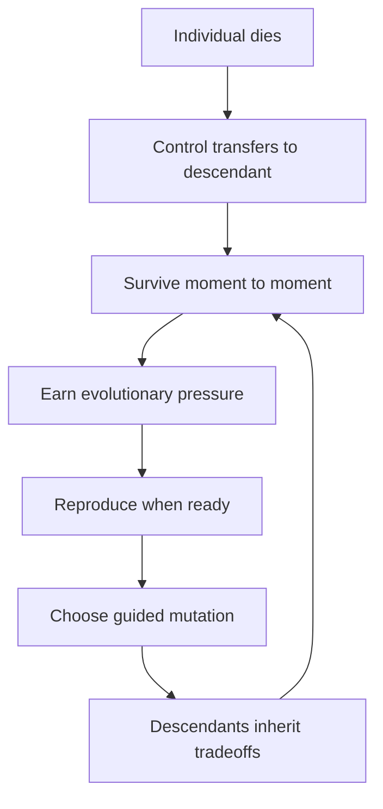

# EvolutionSimGame Project Plan

## Current State

The repo is past seed stage and past the original MVP scaffold. It now contains:

- `EvolutionSimCore` Swift package with deterministic, UI-free simulation logic.
- `EvolutionSimGame` SwiftUI multiplatform app for iOS/iPadOS and macOS.
- `EvolutionSimGame.xcodeproj` generated by XcodeGen from `project.yml`.
- Automated simulation tests and documented build/test commands in [README.md](README.md).
- Gameplay, rendering, art direction, graphics asset, and graphics QA docs.

Implemented gameplay includes movement, food, predators, terrain effects, traits, automatic reproduction, mutation choice, lineage handoff, eras, victory goals, mass-extinction state, tutorial/onboarding views, contextual tips, SwiftUI Canvas rendering, and a Codable simulation save/replay model. Treat this as a **post-MVP alpha**: the core loop exists, but public beta still needs balance, persistence UX, platform QA, accessibility checks, stability evidence, and release operations.

**Product goal:** A native Apple-platform evolution simulator where the player guides a **lineage** from single-cell organism to adapted forms through survival, reproduction, and contextual mutation choices.

**Core loop** (from game design):

## Design Pillars (Non-Negotiable)

These constrain every phase:

- **Visible evolution** — trait changes affect movement, senses, diet, defenses, and habitat access observably
- **Meaningful tradeoffs** — every adaptation has a cost (e.g., fins vs land mobility)
- **Terrain-driven strategy** — biomes create pressure, not hard walls
- **Lineage over individual** — death is consequential but not game-over if reproduction succeeded
- **Game clarity over realism** — simple, understandable biology

## Architectural Invariants

From [AGENTS.md](AGENTS.md), enforced from Phase 0 onward:

- Simulation core testable without UI (`EvolutionSimCore` Swift package, no SwiftUI/UIKit imports)
- Seeded deterministic randomness; explicit fixed time steps (not frame-rate dependent)
- Serializable world/organism state for tests, replay, and future saves
- Clear boundaries: sim / rendering / input / UI / persistence
- Performance-aware for iPhone and iPad, not only Mac

## Key Decisions (Resolved)

| Decision | Choice | Implication |
|----------|--------|-------------|
| MVP playtest platform | **iPad-first** | Adaptive side panels, pointer, and keyboard are the design center; iPhone compacts from iPad layout; macOS extends with desktop affordances |
| World representation | **Continuous 2D** | Floating-point positions, radius-based collision, terrain sampling at coordinates; spatial indexing (e.g., uniform grid) for predators/food queries |
| Rendering | **SwiftUI Canvas** | Confirmed in [docs/rendering-decision.md](docs/rendering-decision.md); revisit SpriteKit/Metal only with measured Canvas limits |
| MVP persistence | **Codable state + seed replay model** | Simulation can serialize/restore state, but durable player-facing save/load UX is a Phase 9 beta requirement |
| Public beta delivery | **Apple-platform beta only** | Use TestFlight/App Store Connect feedback paths and local app data; no accounts, cloud backend, or analytics unless separately approved |

## Original MVP Scope Boundary

Smallest playable version that proved "evolution through survival choices" ([docs/game-design.md](docs/game-design.md) Recommended MVP). Several items originally listed as post-MVP are **implemented in alpha**; **beta-ready** status for those systems is tracked in [docs/beta/beta-readiness-matrix.md](docs/beta/beta-readiness-matrix.md) and Phases 7–12.

| Original MVP in scope | Originally post-MVP — now in alpha (beta-ready varies) |
|-----------------------|--------------------------------------------------------|
| 2D top-down continuous world | Full era progression (Primordial → Ecosystem Dominance) — **implemented** |
| One controllable single-cell organism | All 8 trait categories and body plans — **aspirational** |
| Food particles + simple predators | Rival species, climate shifts — **aspirational** |
| Energy, health, reproduction | Cloud, multiplayer, accounts, analytics — **deferred** |
| 3 terrain types: water, mud, toxic pool | Full biome set — **implemented** at Biomes era+ |
| 6–10 traits with tradeoffs | Scientific-grade biological modeling — **deferred** |
| Reproduction → descendants → mutation choice | Population autonomy at scale — **partial** (descendants, capped) |
| Basic fitness + lineage summary | Player-facing save/load UI — **model only**; UX Phase 9 |
| — | Victory goals, mass extinction, tutorial — **implemented** |
| — | Codable `SavedSimulation` — **implemented**; durable UX Phase 9 |

Beta planning artifacts (Phase 6): [docs/beta/feature-inventory.md](docs/beta/feature-inventory.md), [docs/beta/public-beta-scope.md](docs/beta/public-beta-scope.md), [docs/beta/risk-register.md](docs/beta/risk-register.md).

## Phase Overview

Phases 0–7 are completed milestones. Phases 8–12 are the active public-beta roadmap.

---

## Phase 0 — Foundation and Scaffold

**Goal:** Buildable native Apple project with a testable, UI-free simulation package.

**Deliverables:**

- Swift Package `EvolutionSimCore` (or equivalent) — zero UI dependencies
- Multi-target Xcode app shell: macOS + iOS/iPadOS (shared app structure, platform-specific entry/layout hooks)
- Seeded RNG + fixed-timestep tick loop skeleton
- Continuous 2D world model: bounds, coordinate types, entity IDs, snapshot serialization
- Rendering technology decision record (Canvas vs SpriteKit) with rationale
- [README.md](README.md) updated with build/test commands

**Acceptance criteria:**

- `swift test` passes in `EvolutionSimCore`
- Xcode builds for iPad simulator and macOS
- Deterministic test: same seed + N ticks → identical serialized state
- Snapshot round-trip test (encode/decode world state)

**Primary agent:** `/evolution-simulation-gameplay-specialist`  
**Supporting:** `/evolution-apple-platform-ui-specialist` (app shell, rendering spike)  
**Verify:** `/evolution-verifier` (`swift test`, build smoke)

**Risks:** Over-scaffolding before first mechanic; premature rendering lock-in. **Mitigation:** Spike only; sim package stays renderer-agnostic via snapshot adapter.

---

## Phase 1 — Core Simulation (Headless MVP Mechanics)

**Goal:** Complete MVP simulation logic with no rendering.

**Deliverables (one mechanic at a time, each tested before the next):**

1. **Organism model** — position, velocity, radius, energy, health, age; movement with energy cost
2. **Terrain system** — continuous sampling for water/mud/toxic; compatibility penalties (speed, energy drain, damage)
3. **Food** — spawned particles; consumption and energy gain
4. **Predators** — simple chase AI; health damage; flee behavior driven by sense radius trait
5. **Traits (6–10)** — explicit stat modifiers with tradeoffs; inherited on reproduction
6. **Reproduction** — energy threshold + safe-site check; offspring with inherited traits + small variance
7. **Mutation choice** — post-reproduction, pick 1 of 3 options; deterministic application
8. **Lineage handoff** — on player organism death, control transfers to a living descendant
9. **Fitness metrics** — survival time, offspring count, food efficiency, biomes explored, predator avoidance

**Acceptance criteria:**

- Unit tests cover: starvation, predator kill, terrain penalties, reproduction gate, trait inheritance, mutation application, lineage handoff, extinction (no descendants)
- Seeded replay: full session reproducible from seed + input log
- No UI imports in simulation package

**Primary agent:** `/evolution-simulation-gameplay-specialist`  
**Verify:** `/evolution-verifier` (determinism suite, edge cases)  
**Review:** `/evolution-code-reviewer` (architecture boundaries, scope)

**Risks:** Trait combinatorics; non-deterministic predator behavior. **Mitigation:** Cap traits at MVP set; fixed tick order; seeded AI decisions.

---

## Phase 2 — Gameplay Loop Integration

**Goal:** Close the evolution loop in simulation state; prepare stable API for UI.

**Deliverables:**

- **Evolutionary pressure points** — accumulated from survival events (water exposure, predator near-misses, food scarcity, exploration)
- **Contextual mutation offers** — pressure history biases the 3-option pool (e.g., repeated water → fin/gill/skin/generalized)
- **Descendant population** — semi-autonomous NPC descendants (bounded count, simple wander/forage); player selects representative
- **Sim control API** — pause, step, speed multiplier, reset, seed input, player movement intent
- **Centralized tuning constants** — balancing values in one module

**Acceptance criteria:**

- Tests: pressure history changes mutation offers; population capped; replay from seed + inputs matches
- Sim API documented (types consumed by UI layer)
- Performance note: N descendants at fixed tick rate on iPad-class hardware (headless benchmark)

**Primary agent:** `/evolution-simulation-gameplay-specialist`  
**Verify:** `/evolution-verifier` (pressure→mutation linkage, population bounds, replay)

**Deferred at this phase:** Era transitions, climate, rival species, mass extinction events.

---

## Phase 3 — UI and Rendering (iPad MVP Playable)

**Goal:** First human-playable build; **iPad is the primary playtest target.**

**Deliverables:**

- 2D top-down view rendering sim snapshots (terrain, food, predators, player organism, descendants)
- **iPad layout:** simulation primary; side inspector panel; bottom or radial movement controls; pointer + keyboard shortcuts where natural
- **iPhone layout:** compact HUD and controls derived from iPad design (not a separate product)
- **macOS layout:** extend iPad with menus, toolbar, keyboard commands
- HUD: energy, health, reproduction readiness
- Mutation choice UI at reproduction milestone
- Pause / speed / reset / seed controls
- Inspector: traits, stats, biome compatibility, lineage summary
- Clean sim↔UI boundary: views read immutable snapshots; input forwarded as intents

**Acceptance criteria:**

- Playable session on iPad simulator: move, eat, flee predator, reproduce, choose mutation, die and continue as descendant
- Builds succeed for iPad, iPhone, and macOS targets
- No simulation logic in SwiftUI views
- Touch targets readable on iPhone minimum width

**Primary agent:** `/evolution-apple-platform-ui-specialist`  
**Supporting:** `/evolution-simulation-gameplay-specialist` (API gaps only)  
**Verify:** `/evolution-verifier` (multi-target build, iPad simulator smoke, input flow)

**This phase is the first fun/playtest gate.** Do not expand content until the loop feels understandable on iPad.

---

## Phase 4 — Debug, Inspectability, and Platform Polish

**Goal:** Make evolution legible; differentiate platforms per [AGENTS.md](AGENTS.md).

**Deliverables:**

- Toggleable debug overlays: food density, danger zones, terrain cost, lineage state
- Selected-organism detail with player-facing trait explanations
- iPad: adaptive panels, pointer hover, keyboard shortcuts
- macOS: menus, commands, toolbar, inspector window pattern
- Accessibility labels and UI test identifiers on key controls
- iPhone performance baseline with MVP population

**Acceptance criteria:**

- Overlays toggle without obscuring primary sim view
- VoiceOver reads core controls on iPad
- Stable update rate on iPhone with MVP population cap

**Primary agent:** `/evolution-apple-platform-ui-specialist`  
**Verify:** `/evolution-verifier` (per-platform builds, a11y spot-check, performance note)

---

## Phase 5 — First Post-MVP Content Slice (Completed)

**Goal:** Grow the MVP into a broader alpha without losing the core loop.

**Delivered capabilities:**

1. **Eras and progression:** Primordial Pool through Ecosystem Dominance are represented in simulation config/state.
2. **Expanded terrain:** forest, swamp, desert, tundra, mountain, and ice extend the MVP terrain set.
3. **Expanded traits and mutation communication:** senses, social behavior, night vision, parental care, mutation previews, and organism thumbnails make trait effects more visible.
4. **Victory goals and pressure events:** spread-to-biomes, population, intelligence, and mass-extinction survival paths exist in the core.
5. **Graphics upgrades:** Canvas rendering has dedicated render modules, terrain texture, organism silhouettes, overlays, VFX, and motion/reduce-motion boundaries.
6. **Save/replay model:** `SimulationState`, snapshots, and `SavedSimulation` are Codable; durable app save/load UX remains Phase 9.

**Acceptance criteria:** Automated simulation tests cover the added mechanics, graphics docs identify remaining runtime QA, and the MVP loop still works through movement, food, predators, reproduction, mutation, and lineage handoff.

**Primary agents:** `/evolution-simulation-gameplay-specialist` + `/evolution-apple-platform-ui-specialist`  
**Verify:** `/evolution-verifier` for deterministic tests, builds, and graphics QA follow-up

---

## Public Beta Definition

Public beta means an external Apple-platform player can install a TestFlight build, start a run, understand the goal without reading the repo, play through success or extinction, close and resume safely, and submit actionable feedback. The beta does not need every era, trait category, or visual effect from the full design guide.

**Public beta entry criteria:**

- First-run flow explains movement, food, predators, terrain, reproduction, mutation, lineage handoff, and at least one victory goal.
- Local save/continue survives app relaunch and handles incompatible save versions gracefully.
- iPhone, iPad, and macOS builds pass focused smoke tests with platform-appropriate controls.
- Reduce Motion, VoiceOver labels for core controls, and non-color state cues are verified.
- Worst-case beta population has measured performance evidence on an iPhone-class target.
- Known issues, feedback instructions, privacy copy, and release checklist exist.
- No known release-blocking crash, data-loss bug, or common-start unwinnable seed.

---

## Phase 6 — Current-State Reconciliation and Beta Scope

**Status:** Completed (2026-06-27).

**Goal:** Make planning, docs, and verification agree before more feature work.

**Deliverables:**

- Feature inventory — [docs/beta/feature-inventory.md](docs/beta/feature-inventory.md)
- Public beta scope and non-goals — [docs/beta/public-beta-scope.md](docs/beta/public-beta-scope.md)
- Beta readiness matrix — [docs/beta/beta-readiness-matrix.md](docs/beta/beta-readiness-matrix.md)
- Beta risk register — [docs/beta/risk-register.md](docs/beta/risk-register.md)
- Updated graphics QA checklist with owners for remaining iPad/iPhone, accessibility, VFX, and performance checks

**Acceptance criteria:** Met — docs reconciled; every public beta requirement maps to phase, owner, and gate; scope review pass in public-beta-scope.md.

**Primary agent:** `/evolution-dev-project-manager`
**Support:** `/evolution-verifier`, `/evolution-code-reviewer`

---

## Phase 7 — Beta Gameplay Hardening

**Status:** Completed (2026-06-27). Verified on `main` at commit `684bcc6`.

**Goal:** Turn the implemented loop into a reliable beta run with understandable challenge.

**Deliverables:**

- Representative seed suite for early, mid, and late-run balance checks
- Tuning pass for food density, predator pressure, reproduction thresholds, terrain costs, era thresholds, and victory goals
- Failure/recovery review: starvation, predator chains, toxic starts, overpopulation, mass extinction, and descendant handoff
- Player-facing pacing targets for first food, first reproduction, first mutation, first era transition, and first victory/loss
- Regression tests for common-start viability and deterministic progression outcomes

**Acceptance criteria:** Met — 61 `swift test` passes (15 Phase 7 balance tests); seeds 42 and 1001 viable under naive play; all four victory goals reachable; victory and extinction paths reproducible from seed + input log; tuning centralized in `SimulationTuning.swift`; pacing documented in [docs/beta/pacing-targets.md](docs/beta/pacing-targets.md).

**Primary agent:** `/evolution-simulation-gameplay-specialist`
**Verify:** `/evolution-verifier` for seeded balance tests and replay checks

---

## Phase 8 — Onboarding, Clarity, and Player Feedback

**Goal:** Help a first-time player understand cause, effect, and adaptation without external instructions.

**Deliverables:**

- Tutorial pass for move, eat, avoid predator, terrain, reproduce, mutation, lineage handoff, and victory
- Contextual explanations for death, offspring loss, unsafe reproduction, damaging terrain, and mass extinction
- Mutation cards that clearly show tradeoffs, before/after visuals, and affected terrain compatibility
- Start/new-game copy that explains seed, era, victory goal, and tutorial preset choices
- Player guide update matching the app’s current rules

**Acceptance criteria:**

- Manual first-run smoke: start tutorial, move, eat, reproduce, choose mutation, see lineage/handoff explanation
- Key tutorial and contextual UI has accessibility labels/identifiers
- Player guide and in-app copy agree on reproduction, descendants, terrain, and victory

**Primary agent:** `/evolution-apple-platform-ui-specialist`
**Support:** `/evolution-simulation-gameplay-specialist` for explanation data
**Verify:** `/evolution-verifier` for first-run smoke and docs consistency

---

## Phase 9 — Persistence and Run Management

**Status:** Implementation complete; manual relaunch smoke pending before formal closeout.

**Goal:** Make local runs safe to pause, leave, resume, restart, and share by seed.

**Deliverables:**

- Durable local save/load using versioned Codable simulation state
- Continue, new run, reset, and delete-run flows with confirmation where data loss is possible
- Save schema version and migration policy
- Seed display/copy/share entry point for reproducible bug reports and balancing
- Corrupt/incompatible save handling that returns the player to a safe new-run path

**Acceptance criteria:**

- Save/restore test covers active play, awaiting mutation, victory, and extinction states
- Manual relaunch smoke confirms continue resumes the same tick, phase, player organism, and pending mutation state
- Deleting/resetting a run never affects unrelated local app data
- No cloud storage, accounts, or networking are introduced

**Current note (2026-06-27):** The Phase 9 implementation is in place: single-slot local persistence, versioned app-layer save envelope, Continue flow, autosave triggers, destructive-action confirmations, corrupt/incompatible save recovery, seed copy/share, updated docs, green core tests, green app tests, and green macOS/iPad builds. The remaining gate is the interactive relaunch smoke checklist, so this phase should be treated as **ready to proceed from an engineering standpoint** but **not formally complete until manual runtime verification passes**.

**Primary agent:** `/evolution-apple-platform-ui-specialist`
**Support:** `/evolution-simulation-gameplay-specialist` for state/version boundaries
**Verify:** `/evolution-verifier` for restore tests and relaunch smoke

---

## Phase 10 — Platform Beta Readiness

**Goal:** Validate that the app feels native and usable on iPhone, iPad, and macOS.

**Deliverables:**

- iPhone compact layout pass for controls, HUD, mutation cards, tutorial, and inspector
- iPad layout pass for side panels, pointer affordances, keyboard shortcuts, and simulation visibility
- macOS layout pass for menus, commands, toolbar/inspector behavior, resizing, and keyboard play
- Accessibility pass for VoiceOver labels, Dynamic Type tolerance, Reduce Motion, contrast, and color filters
- App lifecycle pass for background/foreground, pause behavior, autosave triggers, and orientation/window changes

**Acceptance criteria:**

- Build and manual smoke pass on iPhone simulator/device, iPad simulator/device, and macOS
- Core loop is playable with touch, pointer/keyboard, and keyboard-only where platform-appropriate
- Graphics QA checklist has pass/fail results for compact, regular, macOS, overlays, grayscale/color filters, and Reduce Motion

**Primary agent:** `/evolution-apple-platform-ui-specialist`
**Support:** `/evolution-graphics-specialist`
**Verify:** `/evolution-verifier` for multi-platform runtime evidence

---

## Phase 11 — Performance, Stability, and Bug Triage

**Goal:** Establish the evidence needed to trust beta builds under real play.

**Deliverables:**

- Worst-case population/performance scenario for iPhone-class hardware
- Instruments or equivalent frame-time notes for Canvas rendering, overlays, VFX, and high speed multipliers
- Memory baseline for long sessions and save/restore loops
- Crash/data-loss triage checklist and severity definitions
- Release-blocker dashboard or markdown list with owner, reproduction, status, and verification notes

**Acceptance criteria:**

- Worst-case beta scenario meets the documented frame/update budget or has explicit quality fallback rules
- Long-session smoke does not leak unbounded effects, entities, or save data
- All release-blocking bugs are fixed or beta scope is reduced to remove the broken path
- `swift test`, macOS build, iPad build, and focused UI smoke are green on the beta candidate branch

**Primary agent:** `/evolution-verifier`
**Support:** `/evolution-graphics-specialist`, `/evolution-simulation-gameplay-specialist`, `/evolution-apple-platform-ui-specialist`

---

## Phase 12 — Public Beta Release Preparation

**Goal:** Package a beta candidate that external testers can install, understand, and report on.

**Deliverables:**

- TestFlight/App Store Connect checklist: bundle ID, icons, launch screen, screenshots, build number, signing, supported devices, and export/archive notes
- Beta metadata draft: short description, what to test, known issues, feedback instructions, support contact, and privacy summary
- Public beta known-issues document and feedback template with seed/run details
- Reproducible release commands and beta candidate tag/branch notes
- Final docs pass for README, player guide, and graphics QA checklist

**Acceptance criteria:**

- Archived beta candidate installs and launches on target Apple platforms
- TestFlight notes tell testers exactly what loop to try and what feedback to send
- Privacy copy truthfully states that the app uses local simulation data and no custom analytics/backend
- No release-blocking issue remains open

**Primary agent:** `/evolution-dev-project-manager`
**Support:** `/evolution-apple-platform-ui-specialist`, `/evolution-verifier`

---

## Explicitly Deferred

Do not plan or implement unless explicitly requested:

- Cloud backend, accounts, auth, analytics, payments, custom telemetry, or public networking
- Multiplayer / shared online worlds
- Non-Apple platforms
- Full scientific biological model or giant static trait tree
- Full content-complete game with every era, body plan, terrain, and trait category before beta
- Broad engine/framework changes without a decision record and measured need

---

## Agent Handoff Matrix

| Phase | Primary | Support | Verification |
|-------|---------|---------|--------------|
| 0 Foundation | Simulation specialist | UI specialist (shell + render spike) | Verifier: `swift test`, builds |
| 1 Core Sim | Simulation specialist | — | Verifier: determinism, edge cases |
| 2 Gameplay Loop | Simulation specialist | — | Verifier: pressure→mutation, replay |
| 3 UI (iPad MVP) | UI specialist | Simulation specialist (API) | Verifier: iPad smoke, multi-target |
| 4 Polish | UI specialist | Simulation specialist (metrics) | Verifier: a11y, performance |
| 5 Content | Simulation specialist | UI specialist + graphics specialist | Verifier + code reviewer |
| 6 Reconcile scope | Dev project manager | Verifier + code reviewer | Docs consistency gate |
| 7 Gameplay hardening | Simulation specialist | Dev project manager | Seeded balance/replay tests |
| 8 Onboarding clarity | UI specialist | Simulation specialist | First-run smoke + docs consistency |
| 9 Persistence | UI specialist | Simulation specialist | Save/restore tests + relaunch smoke |
| 10 Platform readiness | UI specialist | Graphics specialist | iPhone/iPad/macOS runtime QA |
| 11 Performance/stability | Verifier | Graphics + simulation + UI specialists | Profiling, long-session, release-blocker gates |
| 12 Public beta release | Dev project manager | UI specialist + verifier | Archive/install/release checklist |

Use focused branches for each implementation task, following the active agent environment’s branch naming requirements.

---

## Risks and Mitigations

| Risk | Mitigation |
|------|------------|
| Plan/docs drift from implementation | Phase 6 docs consistency gate before more beta work |
| Content expansion outpaces clarity | Phase 7–8 hardening gates before adding major systems |
| Non-deterministic sim regressions | Keep seeded RNG, fixed tick order, replay tests, and verifier gates on every sim PR |
| Save corruption or data loss | Versioned local saves, migration tests, corrupt-save recovery, and destructive-action confirmations |
| iPhone compact layout becomes second-class | Phase 10 compact-width smoke and graphics QA checklist completion |
| Canvas performance does not scale | Phase 11 profiling gate; coarsen overlays/textures before considering engine changes |
| Public beta implies backend/analytics scope creep | TestFlight/App Store Connect feedback only; no custom backend or telemetry without a new decision |
| External testers cannot explain failures | Contextual death/reproduction/terrain messages and seed sharing for reproducible reports |

---

## Immediate Next Step (Phase 9)

Make local runs safe to pause, leave, resume, restart, and share by seed:

- Durable local save/load using versioned Codable simulation state
- Continue, new run, reset, and delete-run flows with confirmation where data loss is possible
- Save schema version and migration policy
- Seed display/copy/share entry point for reproducible bug reports and balancing
- Corrupt/incompatible save handling that returns the player to a safe new-run path

**Success:** Save/restore test covers active play, awaiting mutation, victory, and extinction states; manual relaunch smoke confirms continue resumes the same tick, phase, player organism, and pending mutation state.

**Recommended prompt target:** `/evolution-apple-platform-ui-specialist` with `/evolution-simulation-gameplay-specialist` for state/version boundaries and `/evolution-verifier` for restore tests and relaunch smoke.

**Planning reference:** [docs/beta/public-beta-scope.md](docs/beta/public-beta-scope.md), [docs/beta/feature-inventory.md](docs/beta/feature-inventory.md).
