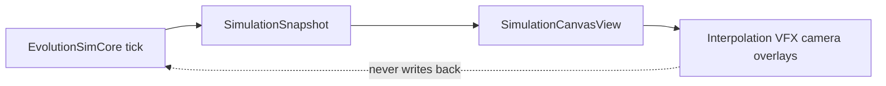
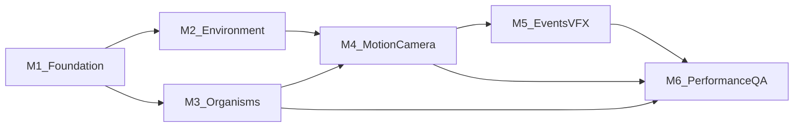

# Graphics Upgrade Plan for `/evolution-graphics-specialist`

## Context

EvolutionSimGame is **playable** with a deterministic sim core and SwiftUI Canvas renderer, but visuals are intentionally minimal. The product pillar **"visible evolution"** ([docs/game-design.md](docs/game-design.md)) is largely unmet: traits change stats in the inspector, not appearance in the world.

**Current rendering** ([EvolutionSimGame/Views/SimulationCanvasView.swift](EvolutionSimGame/Views/SimulationCanvasView.swift)):

- Terrain: colored filled circles per `TerrainRegion`
- Entities: green food, red predators, cyan descendants, yellow player — all ellipses
- Camera: fixed fit-to-world `ViewTransform`; no pan/zoom/follow
- Animation: none; positions jump each 30 Hz tick
- Assets: none (no `.xcassets`, shaders, or sprites)

**Render boundary** (locked by [docs/rendering-decision.md](docs/rendering-decision.md)):



**Population budgets** (from `SimulationTuning`): ≤40 food, ≤5 predators, ≤20 descendants; 30 Hz tick, up to 8× speed.

**What "upgrade" means here:** Not AAA assets or a renderer swap. Make adaptation **legible, cohesive, and mobile-safe** using procedural Canvas drawing, centralized tokens, and UI-only motion/VFX.

---

## Visual Goals

1. **Visible evolution** — armor, size, swim, senses, etc. readable without opening the inspector
2. **Readable simulation** — distinguish player, descendants, predators, food, and terrain at default zoom
3. **Coherent art direction** — one "readable stylized biology" language across eras/biomes
4. **Cause-and-effect clarity** — encode state with shape/motion/iconography, not color alone
5. **Platform-safe performance** — stable redraw at MVP population on iPhone/iPad

**Non-goals:** SpriteKit/Metal migration without measured Canvas failure + decision record update; scientific anatomy; heavy particles/blur; sim behavior changes for visuals.

---

## Milestone Sequence



Use focused branches: `codex/graphics-m{N}-…` — one PR per milestone.

---

## M1 — Foundation: Art Direction and Render Architecture

**Start here.** Fully independent of other agents.

**Deliverables:**

| Output | Path |
|--------|------|
| Art direction doc (palette, shape language, era moods, trait→visual mapping for all `TraitSet` fields) | [docs/art-direction.md](docs/art-direction.md) |
| Procedural asset spec + Performance Budget v0 | [docs/graphics-asset-spec.md](docs/graphics-asset-spec.md) |
| Visual QA checklist (iPad/iPhone, overlays on/off, grayscale/colorblind) | [docs/graphics-qa-checklist.md](docs/graphics-qa-checklist.md) |
| Visual token module | [EvolutionSimGame/Rendering/VisualTokens.swift](EvolutionSimGame/Rendering/VisualTokens.swift) |
| Renderer module split | [EvolutionSimGame/Rendering/](EvolutionSimGame/Rendering/) — `ViewTransform.swift`, `SimulationRenderer.swift`, `TerrainRenderer.swift`, `EntityRenderer.swift`, `OverlayRenderer.swift` |
| Rendering decision addendum | Update [docs/rendering-decision.md](docs/rendering-decision.md) |

**Refactor** [SimulationCanvasView.swift](EvolutionSimGame/Views/SimulationCanvasView.swift) into a thin wrapper delegating to the renderer module. Replace scattered color literals with tokens. Preserve `DebugOverlay` modes and accessibility identifiers (`simulationCanvas`, `terrainLegend`, etc.).

**Acceptance:** Builds pass; `swift test` unchanged; visuals functionally equivalent but token-driven.

---

## M2 — Environment Visuals

**Depends on:** M1 tokens.

**Deliverables:**

- Layered terrain fills with soft edges and subtle procedural texture (Canvas gradients/strokes — no sim changes)
- Distinct silhouette/pattern per `TerrainType` (10 types in `TerrainField.swift`), not hue alone
- Reduced "overlapping plate" look where regions stack
- Constrained world backdrop (vignette/grid/noise) that does not compete with entities
- Update `TerrainLegendView` swatches to match new terrain glyphs
- Optional subtle in-canvas biome-entry cue on `playerCurrentTerrain` change

**Acceptance:** Player identifies water/mud/toxic/forest/desert in ≤2 seconds without legend.

---

## M3 — Organism Visual Language

**Depends on:** M1 tokens. Can parallel-spec with M2 after M1 merges.

**Deliverables:**

- **Role styling:** player, descendant, predator, food each have distinct shape + outline + motion cue (color secondary)
- **Trait-driven draw** from existing snapshot fields (`TraitSet`, `radius`, `velocity`):

| Trait | Visual channel |
|-------|----------------|
| `size` | Body radius (already partial) |
| `armor` | Shell thickness / segmented outline |
| `swimEfficiency` | Tail/fin appendages |
| `senseRadius` | Sensor ring or halo |
| `toxinResistance` | Core filter / membrane pattern |
| `speed` / `metabolism` | Pulse/wobble rate bounds |
| `socialBehavior` | Group proximity halo |
| `nightVision` | Eye/sensor dots |

- Strong player marker (non-color: crown notch, double ring, facing tick)
- Predator angular profile + chase-facing from `velocity`
- Optional inspector thumbnail reusing same renderer

**Acceptance:** Side-by-side low vs high armor/size/swim/sense — clearly different silhouettes. Roles distinguishable with color desaturated.

---

## M4 — Motion and Camera Polish

**Depends on:** M2/M3 draw modules.

**Deliverables:**

- **UI-side interpolation** between previous/current snapshot positions (store last snapshot in view model or renderer; sim untouched)
- Velocity-based facing; idle wobble scaled by `metabolism`
- **Camera policy:** recommend soft follow-player with dead zone + clamp (vs fixed fit-to-world)
- Extend `ViewTransform` with optional follow/zoom; respect safe area in [ContentView.swift](EvolutionSimGame/Views/ContentView.swift)
- Respect `@Environment(\.accessibilityReduceMotion)` — snap positions when enabled

**Coordination:** `/evolution-apple-platform-ui-specialist` if pinch/zoom gestures added (platform-specific).

**Acceptance:** Smooth at 1×–4× speed; no sim test regressions; Reduce Motion disables interpolation.

---

## M5 — Event VFX and Mutation Presentation

**Depends on:** M3 organism renderer.

**Deliverables:**

- Reproduction: brief ring burst at offspring spawn
- Mutation: in-canvas highlight on target + mini-previews in `MutationChoiceView` using shared renderer + `MutationPreview` deltas
- Damage/hazard: subtle flash when health drops (UI snapshot diffing)
- Mass extinction: tint/vignette when `massExtinctionActive`
- Death/lineage handoff: player fade + descendant focus pulse

**Coordination:** `/evolution-apple-platform-ui-specialist` for mutation modal layout/a11y in [GameControlsViews.swift](EvolutionSimGame/Views/GameControlsViews.swift).

**Acceptance:** Effects never block reading predators or terrain hazards; VoiceOver labels on mutation previews.

---

## M6 — Performance, Density, and Visual QA

**Depends on:** M2–M5 integrated.

**Deliverables:**

- Performance Budget v1 with measured redraw cost at max population + overlays
- Optimizations: cached `Path`s, coarser overlay grid on iPhone, draw ordering (terrain → food → descendants → predators → player), reduce per-frame allocations
- Density QA screenshots at min iPhone width + iPad landscape
- Accessibility QA: contrast, non-color role differentiation, overlay opacity caps
- Completed [docs/graphics-qa-checklist.md](docs/graphics-qa-checklist.md) with pass/fail
- Verifier handoff notes for `/evolution-verifier`

**Performance targets:**

| Scenario | Target |
|----------|--------|
| iPhone, 1× speed, no debug overlay | No visible stutter |
| iPhone, 4× speed, max population | Acceptable for playtesting |
| Debug terrain-cost grid | ≤16 ms/frame or auto-coarsen on compact size class |

---

## Dependencies and Coordination

**Graphics can do independently:** M1 entirely; M2/M3 after M1 tokens; M4 interpolation from existing `velocity`; M5 VFX via UI snapshot diffing; M6 profiling.

**Other agents only if needed:**

| Need | Agent | When |
|------|-------|------|
| Optional snapshot hints (`facingAngle`, `bodyPlan`, `lastDamageTick`) | `/evolution-simulation-gameplay-specialist` | Only if M3/M5 cannot work from current fields |
| Pinch/zoom/follow gestures | `/evolution-apple-platform-ui-specialist` | M4 |
| Mutation modal structure/a11y | `/evolution-apple-platform-ui-specialist` | M5 |
| Build/test verification | `/evolution-verifier` | End of each milestone |

**File ownership (reduce merge conflicts):**

- Primary: `EvolutionSimGame/Rendering/`, `docs/art-direction.md`, `docs/graphics-*.md`
- Thin wrapper: `SimulationCanvasView.swift`
- Avoid: `EvolutionSimCore/` unless snapshot extension is explicitly approved

---

## Risks and Validation

| Risk | Mitigation |
|------|------------|
| Canvas cost at 8× + debug grid | Coarsen grid on iPhone; cache paths; measure in M6 |
| Readability at density | Role silhouettes + draw order; player always on top |
| Color-only regression | Grayscale QA gate in M3/M6 |
| Determinism drift | All motion/VFX in UI layer; no RNG in renderer |
| Trait visuals misrepresent mechanics | Map only to existing `TraitSet` effects; document approximations |
| Overlays obscure gameplay | Opacity caps; player/predator on top |

**Validation (every milestone):**

```bash
cd EvolutionSimCore && swift test
xcodebuild -scheme EvolutionSimGame_macOS -destination 'platform=macOS' build
xcodebuild -scheme EvolutionSimGame_iOS -destination 'platform=iOS Simulator,name=iPad (A16)' build
```

Plus iPhone compact layout smoke, 5-minute iPad playtest (move, eat, flee, reproduce, mutate, die→descendant).

---

## Milestone 1 Handoff Prompt

Copy this to `/evolution-graphics-specialist` to begin:

---

**TASK:** Graphics M1 — Art Direction, Visual Tokens, and Renderer Architecture

**Context:** Sim core is UI-free (`EvolutionSimCore`). UI reads immutable `SimulationSnapshot`. Rendering is SwiftUI Canvas in [SimulationCanvasView.swift](EvolutionSimGame/Views/SimulationCanvasView.swift) — primitive circles, hard-coded colors, fixed fit-to-world. Decision record: [docs/rendering-decision.md](docs/rendering-decision.md). Entity caps: ≤40 food, ≤5 predators, ≤20 descendants; 30 Hz tick.

**Do (M1 only):**

1. Read `README.md`, `AGENTS.md`, `docs/game-design.md`, `docs/rendering-decision.md`, `SimulationCanvasView.swift`, [TraitSet.swift](EvolutionSimCore/Sources/EvolutionSimCore/Traits/TraitSet.swift).
2. Create `docs/art-direction.md` — aesthetic ("readable stylized biology"), palette roles, shape language, era moods, full TraitSet→visual mapping.
3. Create `docs/graphics-asset-spec.md` — procedural-first rules, min on-screen sizes, optional future sprite dimensions, Performance Budget v0.
4. Create `docs/graphics-qa-checklist.md` — iPad/iPhone scenarios, overlays on/off, grayscale check.
5. Add `EvolutionSimGame/Rendering/` with `VisualTokens.swift` and split renderers; refactor `SimulationCanvasView` to thin wrapper.
6. Update `docs/rendering-decision.md` addendum (module layout, Canvas retained, SpriteKit/Metal revisit triggers).

**Do not:** Change `EvolutionSimCore` logic; add bitmap assets; implement camera follow, interpolation, or VFX.

**Branch:** `codex/graphics-m1-foundation`

**Success:** Builds pass; `swift test` unchanged; renderer modularized; docs complete; visuals token-driven but functionally equivalent.

---

## Recommended PR Sequence

| PR | Branch | Review focus |
|----|--------|--------------|
| 1 | `codex/graphics-m1-foundation` | Architecture, docs, no behavior change |
| 2 | `codex/graphics-m2-terrain` | Biome readability |
| 3 | `codex/graphics-m3-organisms` | Trait visuals, colorblind check |
| 4 | `codex/graphics-m4-motion-camera` | Feel, reduce motion |
| 5 | `codex/graphics-m5-events` | Clarity vs clutter |
| 6 | `codex/graphics-m6-perf-qa` | Budgets, checklist |

**Immediate next step:** Kick off M1 with the handoff prompt above.
