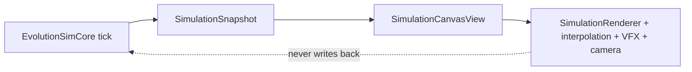
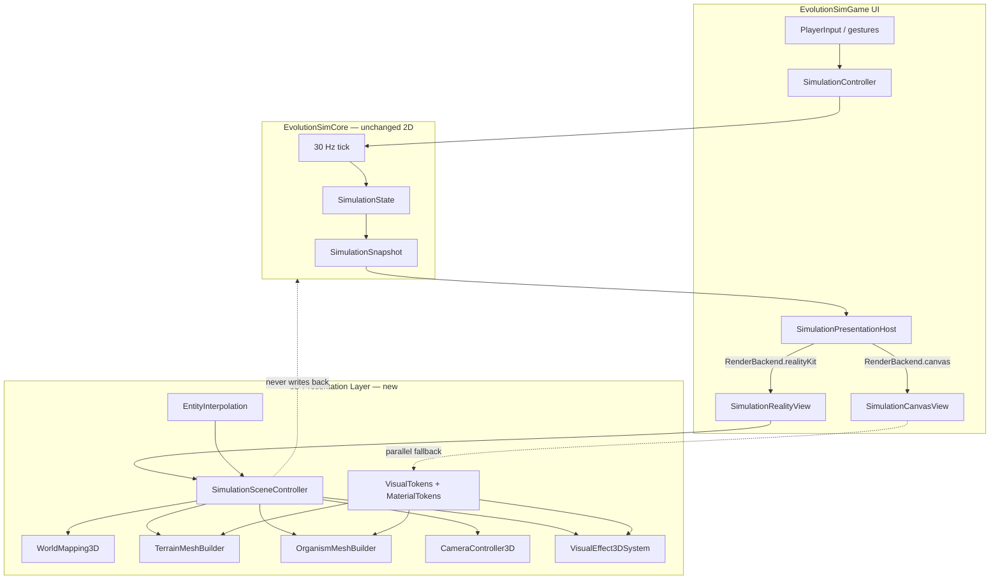
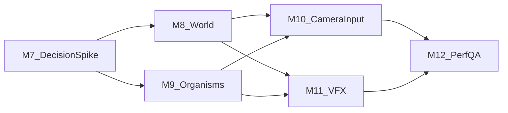

# Graphics Upgrade Plan for `/evolution-graphics-specialist`

## Executive Summary

**Phase 1 (M1–M6) — completed.** EvolutionSimGame now has a modular SwiftUI Canvas renderer (`EvolutionSimGame/Rendering/`), centralized `VisualTokens`, trait-readable organism silhouettes, UI-side interpolation and camera, event VFX, and documented performance/accessibility QA gates. The simulation core remains deterministic, 2D, and UI-free.

**Phase 2 (M7–M12) — 3D presentation.** Upgrade the *game presentation* from flat Canvas drawing to a stylized 3D world while **keeping the simulation 2D** (800×600, 30 Hz tick, existing population caps). Snapshot → presentation adapter pattern is preserved; no sim RNG or authoritative state moves into the renderer.

**Recommended sim dimensionality strategy: (C) phased — 2D sim + 3D presentation now; optional 3D sim later.**

| Option | Description | Verdict |
|--------|-------------|---------|
| A | Keep sim 2D; render in 3D (XZ plane, extruded terrain, trait meshes) | **Phase 2 primary path** |
| B | Extend sim to 3D physics/movement now | **Deferred** — breaks determinism tests, balance, saves, beta scope |
| C | Phased: A first, B only if gameplay warrants | **Recommended** |

Option C preserves architectural invariants (testable core, deterministic replay, Codable saves), reuses completed Canvas art direction and tokens, and avoids blocking public beta (Phases 7–12). A future “3D sim” milestone would be a separate gameplay project with its own decision record—not part of M7–M12.

**Beta timing recommendation: post-beta primary track.** Public beta (TestFlight v1) should ship on the proven Canvas renderer. Phase 11 performance evidence and Phase 10 accessibility QA gates reference Canvas. M7 spike may run **in parallel** with Phases 7–10 on a separate branch but must not block beta merge gates. M8–M12 merge after beta entry criteria are met (or after TestFlight v1 ships), unless product explicitly reprioritizes 3D ahead of beta.

---

## Phase 1 Context (M1–M6, Completed)

EvolutionSimGame is **playable** with a deterministic sim core and SwiftUI Canvas renderer. Phase 1 delivered **visible evolution** via procedural 2D drawing without changing simulation determinism.

**Completed render boundary:**



**Phase 1 module layout** ([EvolutionSimGame/Rendering/](EvolutionSimGame/Rendering/)):

| Module | Role |
|--------|------|
| `VisualTokens.swift` | Colors, opacities, line weights, min sizes |
| `ViewTransform.swift` | 2D world-to-view mapping, follow/zoom |
| `TerrainRenderer.swift` | Biome fills, patterns, soft edges |
| `OrganismRenderer.swift` / `EntityRenderer.swift` | Trait-driven silhouettes, roles |
| `EntityInterpolation.swift` | UI-side position smoothing |
| `VisualEffect.swift` | Event VFX registry |
| `RenderQuality.swift` | Device-tier quality hints |
| `SimulationRenderer.swift` | Draw-order orchestration |
| `OrganismThumbnail.swift` | Shared preview drawing |

**Population budgets** (unchanged): ≤40 food, ≤5 predators, ≤20 descendants; 30 Hz tick, up to 8× speed.

Phase 1 milestone details remain in git history and [docs/rendering-decision.md](docs/rendering-decision.md) M1/M4 addenda. Phase 2 builds on this foundation; it does not discard it.

---

## Phase 2 — 3D Presentation Upgrade

### Visual Goals (3D)

1. **Depth and place** — terrain reads as a living surface (height, water level, biome material), not flat color plates
2. **Visible evolution in volume** — armor, size, appendages, sensor halos readable in 3D silhouette at default camera
3. **Coherent “readable stylized biology”** — carry forward [docs/art-direction.md](docs/art-direction.md); 3D adds depth cues, not realism
4. **Cause-and-effect clarity** — events (reproduce, mutate, damage, extinction) have spatial VFX anchored to world positions
5. **Platform-native 3D controls** — orbit/pinch on touch, pointer drag on iPad/macOS, keyboard shortcuts where appropriate
6. **iPhone-safe performance** — meet budgets at MVP population caps on A-series hardware

### Non-Goals (3D)

- Full 3D simulation physics, vertical movement, or Z-axis collision (deferred beyond M12)
- Scientific anatomy, skeletal animation rigs, or mocap
- Cloud assets, networked texture streaming, or non-Apple renderers
- AR mode as a requirement (optional spike only)
- Rewriting `EvolutionSimCore` for rendering convenience
- Blocking public beta on 3D completion
- Deprecating Canvas before M12 acceptance and iPhone budget sign-off

---

## Key Technology Decisions

### 1. Sim Dimensionality — Recommendation: (C) Phased

**Now (M7–M12):** Treat `SimulationSnapshot` positions as **XZ world coordinates** on a horizontal play plane. Y is presentation-only (terrain height, water surface, mesh offset, VFX lift). Interpolation, facing, and VFX remain UI-layer concerns.

**Mapping contract:**

| Sim field | 3D presentation |
|-----------|-----------------|
| `Organism.position`, `FoodParticle.position`, `Predator.position` | `(x, terrainHeight(x,z), z)` |
| `Organism.velocity` | Facing on XZ plane; optional pitch suppressed |
| `Organism.radius`, `TraitSet` | Mesh scale and procedural appendages |
| `TerrainField.regions` | Extruded mesh / heightfield + biome materials |
| `WorldBounds` (800×600) | XZ extent; Y is artistic scale |

**Later (optional, out of M7–M12 scope):** True 3D movement, volumetric terrain costs, flying/swimming depth—requires gameplay specialist, new tests, save schema review, and a separate decision record.

### 2. Renderer Technology — Recommendation: SwiftUI + RealityKit (primary)

| Option | Role | Notes |
|--------|------|-------|
| **SwiftUI + RealityKit (`RealityView`)** | **Primary** | Native multiplatform (iOS/iPadOS/macOS), embeds in existing SwiftUI shell, entity-component model, good Metal-backed perf |
| SceneKit (`SCNView` representable) | **Documented fallback** | Use if RealityKit gaps block terrain blending, macOS edge cases, or material needs; maintenance-mode API |
| Raw Metal | **Not primary** | Only via RealityKit custom materials or measured hotspot optimization |
| SpriteKit | **Out of scope** | 2.5D only; does not meet 3D goal |
| Hybrid SwiftUI + RealityKit + Canvas | **Transition strategy** | `RenderBackend` flag; Canvas default until M12 |

**Primary path rationale:** RealityKit integrates with SwiftUI (`RealityView`), aligns with Apple’s modern 3D stack, supports procedural meshes (`MeshResource`), PBR materials, particles, and runs on all three targets. SceneKit remains the fallback if the M7 spike reveals blocking issues (e.g., multi-biome terrain stitching, macOS lifecycle quirks).

### 3. Relationship to Completed Canvas Work

| Asset | Phase 2 treatment |
|-------|-------------------|
| `VisualTokens` | **Keep and extend** — add `MaterialTokens` or 3D material builders that read same hue/opacity roles |
| [docs/art-direction.md](docs/art-direction.md) | **Keep** — add §3D presentation (height scale, water level, mesh simplicity rules) |
| Trait→visual mapping (M3) | **Port logic** — `OrganismRenderer` rules become inputs to `OrganismMeshBuilder`; do not duplicate divergent mapping |
| `EntityInterpolation` | **Reuse** — same snapshot diffing; output feeds 3D entity transforms |
| `VisualEffect` | **Extend** — 3D effect types alongside 2D during parallel-run |
| `ViewTransform` | **Parallel** — new `CameraController3D` / `WorldMapping3D`; 2D transform kept for Canvas fallback |
| `SimulationRenderer` | **Parallel** — new `SimulationSceneController` orchestrates 3D scene graph |
| `SimulationCanvasView` | **Keep until M12** — behind `RenderBackend.canvas`; default for beta |
| `OrganismThumbnail` | **Dual backend** — Canvas thumbnail until 3D preview proven; optional RealityKit snapshot later |

**Deprecation strategy:** Parallel-run M7–M11; `RenderBackend.realityKit` opt-in (Settings/debug) → default-on after M12 iPhone sign-off → Canvas retained one release as fallback → remove Canvas path only after explicit product approval.

---

## Phase 2 Architecture



**Data flow:** `SimulationSnapshot` remains the sole render input. 3D layer maps 2D positions to XZ, samples terrain height procedurally (no sim change), applies interpolated transforms and effects, and never mutates simulation state or introduces RNG.

---

## Phase 2 Milestone Sequence



Use focused branches: `codex/graphics-m{N}-…` — one PR per milestone.

---

## M7 — 3D Decision Record, Spike, and Render Backend Flag

**Depends on:** M1–M6 complete.

**Primary agent:** `/evolution-graphics-specialist`  
**Support:** `/evolution-apple-platform-ui-specialist` (RealityView hosting), `/evolution-verifier` (build smoke)

**Deliverables:**

| Output | Path |
|--------|------|
| 3D decision record addendum | [docs/rendering-decision.md](docs/rendering-decision.md) — §Phase 2 3D |
| 3D art-direction supplement | [docs/art-direction.md](docs/art-direction.md) — §3D presentation rules |
| 3D asset/perf spec supplement | [docs/graphics-asset-spec.md](docs/graphics-asset-spec.md) — mesh LOD, poly budgets |
| Render backend enum + settings hook | [EvolutionSimGame/Rendering/RenderBackend.swift](EvolutionSimGame/Rendering/RenderBackend.swift) |
| Presentation host (switches Canvas/RealityKit) | [EvolutionSimGame/Views/SimulationPresentationHost.swift](EvolutionSimGame/Views/SimulationPresentationHost.swift) |
| 3D module scaffold | [EvolutionSimGame/Rendering3D/](EvolutionSimGame/Rendering3D/) |
| World mapping (2D→XZ) | [EvolutionSimGame/Rendering3D/WorldMapping3D.swift](EvolutionSimGame/Rendering3D/WorldMapping3D.swift) |
| Spike scene + prototype view | [EvolutionSimGame/Rendering3D/SimulationSceneController.swift](EvolutionSimGame/Rendering3D/SimulationSceneController.swift), [EvolutionSimGame/Views/SimulationRealityView.swift](EvolutionSimGame/Views/SimulationRealityView.swift) |
| Material token helpers | [EvolutionSimGame/Rendering3D/MaterialTokens.swift](EvolutionSimGame/Rendering3D/MaterialTokens.swift) |
| Spike notes (pass/fail vs SceneKit fallback) | [docs/rendering-3d-spike-notes.md](docs/rendering-3d-spike-notes.md) |

**Spike scope:** Static terrain mesh from one snapshot, one organism mesh, directional light + sky, camera at fixed angle, 60 fps smoke on iPad simulator and macOS. Document RealityKit blockers if any.

**Acceptance criteria:**

- `RenderBackend` toggles between existing Canvas view and RealityKit prototype without sim changes
- `swift test` unchanged; no `EvolutionSimCore` edits
- Decision record documents primary (RealityKit), fallback (SceneKit), and 2D-sim/3D-present mapping
- macOS + iPad builds pass; iPhone build passes (prototype may be low-detail)

**Sim core changes:** None.

---

## M8 — 3D World Presentation (Terrain, Lighting, Sky)

**Depends on:** M7 scaffold merged.

**Primary agent:** `/evolution-graphics-specialist`  
**Support:** `/evolution-verifier`

**Deliverables:**

| Output | Path |
|--------|------|
| Terrain height function + biome height presets | [EvolutionSimGame/Rendering3D/TerrainHeightModel.swift](EvolutionSimGame/Rendering3D/TerrainHeightModel.swift) |
| Terrain mesh generation from `TerrainField` | [EvolutionSimGame/Rendering3D/TerrainMeshBuilder.swift](EvolutionSimGame/Rendering3D/TerrainMeshBuilder.swift) |
| Biome PBR materials from `VisualTokens.Terrain` | [EvolutionSimGame/Rendering3D/TerrainMaterialFactory.swift](EvolutionSimGame/Rendering3D/TerrainMaterialFactory.swift) |
| Water plane / toxic pool visual treatment | [EvolutionSimGame/Rendering3D/WaterSurfaceEntity.swift](EvolutionSimGame/Rendering3D/WaterSurfaceEntity.swift) |
| Lighting + sky/backdrop rig | [EvolutionSimGame/Rendering3D/EnvironmentRig.swift](EvolutionSimGame/Rendering3D/EnvironmentRig.swift) |
| Era mood tint hook (optional) | [EvolutionSimGame/Rendering3D/EraEnvironmentProfile.swift](EvolutionSimGame/Rendering3D/EraEnvironmentProfile.swift) |
| Legend alignment note | Update [EvolutionSimGame/Views/TerrainLegendView.swift](EvolutionSimGame/Views/TerrainLegendView.swift) swatch labels if 3D preview active |

**Acceptance criteria:**

- All 10 `TerrainType` values distinguishable in 3D within ≤3 s at default camera (color + height + material pattern)
- Terrain mesh updates when snapshot terrain regions change (era transition / world events)
- Water and toxic biomes read as surface-level hazards, not flat paint
- Biome identity holds in grayscale (non-color cues per art direction)
- No per-frame mesh rebuild at steady state; diff or cache by terrain hash

**Sim core changes:** None.

---

## M9 — 3D Organism Meshes (Trait-Driven Procedural Geometry)

**Depends on:** M7; parallel with M8 after M7.

**Primary agent:** `/evolution-graphics-specialist`  
**Support:** `/evolution-simulation-gameplay-specialist` (only if snapshot fields insufficient), `/evolution-verifier`

**Deliverables:**

| Output | Path |
|--------|------|
| Trait→mesh parameter mapping (ports M3 table) | [EvolutionSimGame/Rendering3D/OrganismMeshBlueprint.swift](EvolutionSimGame/Rendering3D/OrganismMeshBlueprint.swift) |
| Procedural mesh builder | [EvolutionSimGame/Rendering3D/OrganismMeshBuilder.swift](EvolutionSimGame/Rendering3D/OrganismMeshBuilder.swift) |
| Role variants (player, descendant, predator, food) | [EvolutionSimGame/Rendering3D/EntityMeshFactory.swift](EvolutionSimGame/Rendering3D/EntityMeshFactory.swift) |
| Entity pool / scene attachment | [EvolutionSimGame/Rendering3D/EntitySceneBridge.swift](EvolutionSimGame/Rendering3D/EntitySceneBridge.swift) |
| Facing from velocity (XZ) | Integrated in `EntitySceneBridge` |
| 3D thumbnail/preview (optional) | [EvolutionSimGame/Rendering3D/OrganismMeshPreview.swift](EvolutionSimGame/Rendering3D/OrganismMeshPreview.swift) |

**Trait channels (must match M3):**

| Trait | 3D channel |
|-------|------------|
| `size` | Uniform scale / body radius |
| `armor` | Shell thickness, segmented outer mesh |
| `swimEfficiency` | Fin/tail extrusions |
| `senseRadius` | Transparent sensor ring mesh |
| `toxinResistance` | Membrane shader parameter |
| `speed` / `metabolism` | Pulse animation rate |
| `socialBehavior` | Proximity halo |
| `nightVision` | Emissive eye dots |

**Acceptance criteria:**

- Side-by-side low vs high armor/size/swim/sense organisms clearly differ in 3D silhouette
- Roles distinguishable with color desaturated
- Player marker (non-color: crown notch, double ring, or equivalent geometry) visible at default zoom
- Food reads as small luminous motes; predators angular vs rounded cells
- Poly count per organism within budget (see M12; target ≤2k tris per organism at high quality)

**Sim core changes:** None unless approved—prefer deriving all visuals from existing `Organism`, `TraitSet`, `radius`, `velocity`.

---

## M10 — 3D Camera and Input

**Depends on:** M8 + M9 integrated enough for framing tests.

**Primary agent:** `/evolution-apple-platform-ui-specialist`  
**Support:** `/evolution-graphics-specialist`, `/evolution-verifier`

**Deliverables:**

| Output | Path |
|--------|------|
| Camera controller (orbit, follow, zoom, clamp) | [EvolutionSimGame/Rendering3D/CameraController3D.swift](EvolutionSimGame/Rendering3D/CameraController3D.swift) |
| Camera presets (whole-world, follow-player) | [EvolutionSimGame/Rendering3D/CameraPresets.swift](EvolutionSimGame/Rendering3D/CameraPresets.swift) |
| Gesture handling (pinch, pan, rotate) | [EvolutionSimGame/Views/SimulationRealityView.swift](EvolutionSimGame/Views/SimulationRealityView.swift) |
| macOS pointer/keyboard camera shortcuts | [EvolutionSimGame/Platform/macOS/CameraKeyboardShortcuts.swift](EvolutionSimGame/Platform/macOS/CameraKeyboardShortcuts.swift) (or `#if os` in view) |
| Terrain height readability aids (optional contour overlay) | [EvolutionSimGame/Rendering3D/TerrainReadabilityOverlay.swift](EvolutionSimGame/Rendering3D/TerrainReadabilityOverlay.swift) |
| Reduce Motion: disable camera inertia / snap | Wire `@Environment(\.accessibilityReduceMotion)` in `SimulationRealityView` |

**Camera policy:**

- **Default:** Whole-world oblique angle (strategy awareness—off-screen predators matter)
- **Follow mode:** Soft follow player with dead zone (port M4 intent from `ViewTransform`)
- **Zoom:** Pinch / scroll within clamped range; never lose terrain context at min zoom
- **Orbit:** One-finger drag (touch) or pointer drag (iPad/macOS) around world center or player

**Acceptance criteria:**

- Playable on iPhone one-hand: pinch zoom + two-finger orbit without obscuring HUD
- iPad pointer hover/drag and macOS keyboard shortcuts documented
- Follow mode respects world bounds clamp from M4
- Reduce Motion disables smooth camera interpolation
- Accessibility identifiers preserved on simulation host (`simulationCanvas` equivalent for 3D)

**Sim core changes:** None.

---

## M11 — 3D VFX and Event Presentation

**Depends on:** M9 entity bridge; M8 for world anchoring.

**Primary agent:** `/evolution-graphics-specialist`  
**Support:** `/evolution-apple-platform-ui-specialist` (mutation UI), `/evolution-verifier`

**Deliverables:**

| Output | Path |
|--------|------|
| 3D effect types mirroring M5 | [EvolutionSimGame/Rendering3D/VisualEffect3D.swift](EvolutionSimGame/Rendering3D/VisualEffect3D.swift) |
| Effect system (spawn, lifetime, pool) | [EvolutionSimGame/Rendering3D/VisualEffect3DSystem.swift](EvolutionSimGame/Rendering3D/VisualEffect3DSystem.swift) |
| Snapshot diff hook (reuse M5 patterns) | Extend [EvolutionSimGame/Views/SimulationPresentationHost.swift](EvolutionSimGame/Views/SimulationPresentationHost.swift) or shared [EvolutionSimGame/Rendering/VisualEffect.swift](EvolutionSimGame/Rendering/VisualEffect.swift) |
| Mutation preview 3D (optional) | [EvolutionSimGame/Rendering3D/MutationMeshPreview.swift](EvolutionSimGame/Rendering3D/MutationMeshPreview.swift) + [EvolutionSimGame/Views/GameControlsViews.swift](EvolutionSimGame/Views/GameControlsViews.swift) |

**Events to cover (parity with M5):**

- Reproduction ring burst at spawn
- Mutation highlight on target organism
- Damage flash on health drop
- Mass extinction atmosphere (fog/tint/sky)
- Death / lineage handoff (player fade, descendant pulse)

**Acceptance criteria:**

- Effects anchored to correct XZ world positions at terrain height
- Effects never obscure predator or hazard readability >500 ms
- Mutation previews include accessibility labels (VoiceOver)
- UI snapshot diffing only—no sim changes, no renderer RNG
- Reduce Motion simplifies or disables non-essential particles

**Sim core changes:** None unless snapshot diff insufficient—prefer UI-side diff like M5.

---

## M12 — 3D Performance QA, Fallback Strategy, Canvas Deprecation Plan

**Depends on:** M8–M11 integrated.

**Primary agent:** `/evolution-verifier`  
**Support:** `/evolution-graphics-specialist`, `/evolution-apple-platform-ui-specialist`

**Deliverables:**

| Output | Path |
|--------|------|
| 3D performance budget v1 | [docs/graphics-asset-spec.md](docs/graphics-asset-spec.md) — §3D budgets |
| 3D QA checklist rows | [docs/graphics-qa-checklist.md](docs/graphics-qa-checklist.md) — §3D scenarios |
| Quality tier implementation | Extend [EvolutionSimGame/Rendering/RenderQuality.swift](EvolutionSimGame/Rendering/RenderQuality.swift) for 3D LOD |
| Entity/terrain pooling audit | [EvolutionSimGame/Rendering3D/SimulationSceneController.swift](EvolutionSimGame/Rendering3D/SimulationSceneController.swift) |
| Deprecation plan doc | [docs/rendering-decision.md](docs/rendering-decision.md) — Canvas sunset criteria |
| Default backend switch | Settings / `RenderBackend` default → `.realityKit` after sign-off |

**3D performance targets (iPhone, MVP caps, 1× speed):**

| Metric | Target |
|--------|--------|
| Frame time (worst-case population) | ≤16.7 ms median (60 fps); ≤25 ms p95 |
| Frame time (4× speed) | ≤33 ms median (30 fps acceptable) |
| Memory (30 min session) | Stable; no unbounded mesh cache growth |
| Draw calls / entity count | ≤120 scene entities incl. terrain chunks |
| Organism tris (high / low LOD) | ≤2k / ≤800 each |
| Terrain mesh | Single rebuild on terrain change; ≤50k tris total at high |

**Quality fallback rules:**

- iPhone compact: low LOD meshes, simplified water shader, reduced shadow quality
- Debug overlays active: auto-disable soft shadows / post-processing
- Thermal pressure (if detectable): step down LOD before dropping frame rate

**Acceptance criteria:**

- Worst-case scenario (40 food, 5 predators, 20 descendants) meets targets on reference iPhone (document device model)
- iPad + macOS smoke pass with 3D backend default
- Grayscale + colorblind + Reduce Motion rows pass in QA checklist
- Canvas fallback works via Settings for one release cycle
- Verifier handoff notes archived for release-blocker dashboard

**Sim core changes:** None.

---

## Technology Decision Record Outline (for docs/rendering-decision.md)

Add a **§Phase 2: 3D Presentation** section with:

1. **Decision:** SwiftUI + RealityKit (`RealityView`) as primary 3D presentation; simulation remains 2D; SceneKit documented as fallback.
2. **Trigger that justified 3D:** Product direction to move from 2D Canvas to 3D game presentation post-M6; not a Canvas performance failure (Canvas remains valid for beta).
3. **Options considered:** RealityKit vs SceneKit vs raw Metal vs hybrid Canvas+3D overlay.
4. **Mapping contract:** 2D sim coordinates → XZ plane; Y presentation-only; table of snapshot fields → 3D entities.
5. **Adapter pattern update:** Diagram `SimulationSnapshot → SimulationPresentationHost → SimulationRealityView → SimulationSceneController`.
6. **Determinism statement:** No RNG in 3D layer; interpolation/VFX remain non-authoritative.
7. **Fallback / feature flag:** `RenderBackend` enum; Canvas retained until M12 sign-off.
8. **SceneKit fallback criteria:** List blockers from M7 spike that would trigger switch.
9. **When to revisit 3D sim:** Explicit non-goal for M7–M12; requires separate gameplay decision record.
10. **Verification:** Build matrix, iPhone frame budget, accessibility gates.

---

## Dependencies and Coordination

| Need | Agent | Milestone | Notes |
|------|-------|-----------|-------|
| 3D decision + spike | `/evolution-graphics-specialist` | M7 | Owner of Rendering3D module |
| RealityView hosting, settings UX | `/evolution-apple-platform-ui-specialist` | M7, M10 | Platform gestures, macOS shortcuts |
| Camera/gesture polish | `/evolution-apple-platform-ui-specialist` | M10 | Primary owner |
| Mutation modal 3D preview layout | `/evolution-apple-platform-ui-specialist` | M11 | a11y labels |
| Snapshot field gaps | `/evolution-simulation-gameplay-specialist` | M9/M11 only if blocked | Avoid unless necessary |
| Build/test/perf verification | `/evolution-verifier` | Each milestone; M12 lead | Instruments evidence |
| Beta scope guardrail | `/evolution-dev-project-manager` | M7 kickoff | Confirm post-beta sequencing |

**File ownership (reduce merge conflicts):**

| Owner | Paths |
|-------|-------|
| Graphics | `EvolutionSimGame/Rendering3D/**`, `docs/art-direction.md`, `docs/graphics-*.md`, `docs/rendering*.md` |
| UI platform | `SimulationRealityView.swift`, `SimulationPresentationHost.swift`, `ContentView.swift`, `GameControlsViews.swift`, Platform camera shortcuts |
| Simulation | `EvolutionSimCore/**` — **avoid** unless explicit snapshot extension approved |
| Verifier | QA docs, perf notes, checklist execution |

**Beta coordination:** Phases 7–12 proceed on Canvas. M7 may run in parallel without merging to `main` until beta gates clear. M8+ default merge target is post-beta `main` unless reprioritized.

---

## Risks and Validation

| Risk | Mitigation |
|------|------------|
| 3D scope blocks beta | Post-beta primary track; M7 spike only in parallel; Canvas stays default until M12 |
| iPhone GPU thermal / frame drops | LOD tiers, mesh pooling, effect caps, M12 Instruments gate |
| Trait meshes misrepresent mechanics | Port M3 mapping 1:1; document approximations in art direction |
| Determinism drift | No RNG in 3D; no sim writes from scene controller |
| RealityKit macOS gaps | M7 spike; SceneKit fallback documented |
| Merge conflicts with UI beta work | Separate `Rendering3D/` module; presentation host switch |
| Save/replay incompatibility | No sim changes in M7–M12; 3D is presentation-only |
| Accessibility regression | Reduce Motion, VoiceOver, grayscale gates in M12 |
| Terrain mesh rebuild cost | Cache by terrain hash; diff regions |
| Camera disorientation | Whole-world default; readability overlay; follow dead zone |

**Validation (every Phase 2 milestone):**

```bash
cd EvolutionSimCore && swift test
xcodebuild -scheme EvolutionSimGame_macOS -destination 'platform=macOS' build
xcodebuild -scheme EvolutionSimGame_iOS -destination 'platform=iOS Simulator,name=iPad (A16)' build
# iPhone compact — required from M10 onward:
xcodebuild -scheme EvolutionSimGame_iOS -destination 'platform=iOS Simulator,name=iPhone 16' build
```

Plus: 5-minute playtest (move, eat, flee, reproduce, mutate, die→descendant) with `RenderBackend.realityKit`; toggle Canvas fallback and confirm parity; grayscale screenshot pass for M9+.

---

## Recommended PR Sequence (Phase 2)

| PR | Branch | Owner focus | Review focus |
|----|--------|-------------|--------------|
| 7 | `codex/graphics-m7-3d-decision-spike` | Graphics + UI | Decision record, spike viability, no sim diff |
| 8 | `codex/graphics-m8-3d-world` | Graphics | Biome readability, mesh caching |
| 9 | `codex/graphics-m9-3d-organisms` | Graphics | Trait fidelity vs M3, poly budget |
| 10 | `codex/graphics-m10-3d-camera` | UI + Graphics | Gestures, follow/orbit, Reduce Motion |
| 11 | `codex/graphics-m11-3d-vfx` | Graphics + UI | Clarity vs clutter, mutation preview a11y |
| 12 | `codex/graphics-m12-3d-perf-qa` | Verifier + Graphics | iPhone budgets, fallback plan, QA checklist |

**Immediate next step (post-beta or parallel spike):** Kick off M7 with the handoff prompt below.

---

## Phase 1 Milestone Reference (Completed)

### M1 — Foundation: Art Direction and Render Architecture

**Deliverables:** Art direction doc, graphics asset spec, QA checklist, `VisualTokens`, renderer module split, rendering decision addendum.

**Acceptance:** Builds pass; `swift test` unchanged; visuals token-driven.

### M2 — Environment Visuals

**Deliverables:** Layered terrain fills, biome identity, legend alignment, backdrop.

**Acceptance:** Player identifies water/mud/toxic/forest/desert in ≤2 seconds without legend.

### M3 — Organism Visual Language

**Deliverables:** Role styling, trait-driven draw from `TraitSet`, player marker, predator profile.

**Acceptance:** Side-by-side trait variants clearly different; roles distinguishable with color desaturated.

### M4 — Motion and Camera Polish

**Deliverables:** UI-side interpolation, velocity facing, soft-follow camera, Reduce Motion support.

**Acceptance:** Smooth at 1×–4× speed; no sim test regressions.

### M5 — Event VFX and Mutation Presentation

**Deliverables:** Reproduction/mutation/damage/extinction VFX, mutation preview visuals.

**Acceptance:** Effects never block reading predators or terrain hazards.

### M6 — Performance, Density, and Visual QA

**Deliverables:** Performance Budget v1, path caching, density/a11y QA checklist, verifier handoff.

**Acceptance:** iPhone 1× no stutter; debug grid ≤16 ms/frame or auto-coarsen.

See [docs/rendering-decision.md](docs/rendering-decision.md) for M1/M4 addenda.

---

## Milestone 7 Handoff Prompt

Copy this to `/evolution-graphics-specialist` to begin Phase 2:

```
TASK TITLE:
Graphics M7 — 3D Decision Record, RealityKit Spike, and Render Backend Flag

TASK OBJECTIVE:
Establish the Phase 2 3D presentation foundation: document the renderer choice (RealityKit primary, SceneKit fallback), prove a minimal 3D scene driven by SimulationSnapshot without touching EvolutionSimCore, and introduce a RenderBackend flag that switches between the existing Canvas view and a new RealityKit prototype.

RECOMMENDED CURSOR MODEL:
claude-opus-4-7-thinking-xhigh

RECOMMENDED CODEX MODEL:
gpt-5.4-medium

RECOMMENDED IDE:
Cursor

RECOMMENDED CODEX PLUGINS:
None

RECOMMENDED CODEX SKILLS:
None

MODEL / IDE / PLUGIN / SKILL RATIONALE:
Architecture + RealityKit API exploration + multi-file scaffold benefits from a strong reasoning model. UI hosting is small but must be correct on macOS and iOS. No special plugins required.

COPY-PASTE PROMPT:

You are implementing Graphics Milestone M7 for EvolutionSimGame — the first 3D presentation milestone.

## Objective
Create the Phase 2 3D foundation: decision documentation, a `Rendering3D` module scaffold, a RealityKit spike scene driven by `SimulationSnapshot`, and a `RenderBackend` flag that toggles between the existing Canvas renderer and the new 3D prototype. The simulation core must remain unchanged (2D, deterministic, 30 Hz).

## Project context and source-of-truth files
- Post-MVP alpha; Phase 1 graphics M1–M6 are complete (Canvas modular renderer).
- Sim core: `EvolutionSimCore` — deterministic, UI-free, 2D world 800×600, 30 Hz tick.
- Render boundary: `SimulationSnapshot` is the sole render input; renderer never writes back.
- Completed Canvas module: `EvolutionSimGame/Rendering/` (VisualTokens, SimulationRenderer, EntityInterpolation, etc.).
- Decision record: `docs/rendering-decision.md` (Canvas chosen for MVP; revisit triggers documented).
- Art direction: `docs/art-direction.md`, `docs/graphics-asset-spec.md`, `docs/graphics-qa-checklist.md`.
- Population caps: ≤40 food, ≤5 predators, ≤20 descendants.
- Public beta (Phases 7–12) ships on Canvas; this milestone must not block beta and should keep Canvas as default.

Read first: `README.md`, `AGENTS.md`, `docs/rendering-decision.md`, `docs/art-direction.md`, `EvolutionSimGame/Views/SimulationCanvasView.swift`, `EvolutionSimGame/Rendering/SimulationRenderer.swift`, `EvolutionSimCore/Sources/EvolutionSimCore/Simulation/SimulationController.swift` (SimulationSnapshot).

## Constraints and non-goals
- Do NOT change `EvolutionSimCore` simulation logic, tuning, or tests.
- Do NOT introduce cloud services, networking, or non-Apple renderers.
- Do NOT implement full terrain/organism/VFX parity (that is M8–M11).
- Do NOT deprecate or delete Canvas code.
- Do NOT add hidden RNG to any renderer code.
- Keep 2D sim → 3D presentation mapping: sim (x,y) maps to world XZ; Y is presentation-only height.
- Primary 3D stack: SwiftUI + RealityKit (`RealityView`). Document SceneKit as fallback only if spike reveals blockers.
- Branch: `codex/graphics-m7-3d-decision-spike`
- Preserve unrelated uncommitted changes; do not commit unless explicitly asked.

## Implementation instructions

1. **Decision documentation**
   - Add §Phase 2: 3D Presentation to `docs/rendering-decision.md` covering: RealityKit primary, 2D-sim/3D-present strategy, adapter diagram update, determinism statement, SceneKit fallback criteria, Canvas parallel-run plan.
   - Add a short §3D presentation supplement to `docs/art-direction.md` (stylized biology in depth, not realism).
   - Add 3D mesh/poly budget placeholders to `docs/graphics-asset-spec.md`.
   - Create `docs/rendering-3d-spike-notes.md` with spike results, device/simulator used, frame observations, and go/no-go on RealityKit.

2. **Render backend switch**
   - Add `EvolutionSimGame/Rendering/RenderBackend.swift` enum (`.canvas`, `.realityKit`).
   - Add `EvolutionSimGame/Views/SimulationPresentationHost.swift` that switches between `SimulationCanvasView` and the new 3D view based on backend (default `.canvas`).
   - Wire host into `ContentView.swift` (or equivalent simulation container) replacing direct `SimulationCanvasView` usage.
   - Optional: Settings/debug toggle for backend (UserDefaults or existing settings pattern).

3. **Rendering3D module scaffold**
   Create `EvolutionSimGame/Rendering3D/` with:
   - `WorldMapping3D.swift` — map sim `CGPoint`/world coords to RealityKit XZ positions and scale.
   - `MaterialTokens.swift` — build SimpleMaterial/UnlitMaterial from existing `VisualTokens` colors.
   - `SimulationSceneController.swift` — owns RealityKit content for one snapshot: ground plane or simple terrain stub, one organism mesh, food/predator placeholders, lighting.
   - `EnvironmentRig.swift` — directional light + neutral sky/backdrop.
   - `SimulationRealityView.swift` in Views — `RealityView` wrapper, passes snapshot, handles resize.

4. **Spike content (minimal but real)**
   - Render terrain regions as colored extruded patches OR a single mesh heightfield stub showing ≥3 distinguishable biome materials.
   - Render player organism as procedural mesh (sphere + simple marker) positioned via snapshot.
   - Position food/predators as simple meshes/spheres at mapped XZ coordinates.
   - Static camera at oblique angle; no orbit required in M7 (M10 adds camera).
   - Reuse `EntityInterpolation` data path if straightforward; otherwise snap to snapshot positions (document in spike notes).

5. **Coordination hooks**
   - Note any blockers needing `/evolution-apple-platform-ui-specialist` (gestures) or `/evolution-simulation-gameplay-specialist` (snapshot fields) in spike notes — do not expand scope to fix them in M7.

## Success criteria
- macOS and iPad builds pass; iPhone build passes.
- `cd EvolutionSimCore && swift test` — zero failures, zero sim diffs.
- `RenderBackend.canvas` preserves existing Canvas behavior (default).
- `RenderBackend.realityKit` shows a 3D scene updating from live snapshot (terrain stub + entities + light).
- Decision record and spike notes committed in repo (if committing) with clear primary/fallback renderer choice.
- No `EvolutionSimCore` source changes.

## Verification steps
Run:
cd EvolutionSimCore && swift test
xcodebuild -scheme EvolutionSimGame_macOS -destination 'platform=macOS' build
xcodebuild -scheme EvolutionSimGame_iOS -destination 'platform=iOS Simulator,name=iPad (A16)' build

Manual: run app, toggle 3D backend, confirm snapshot tick updates entity positions in RealityKit view; switch back to Canvas and confirm parity with pre-M7 behavior; confirm Reduce Motion does not crash 3D path.

## Reporting requirements and stop conditions
Report: files created/changed, build/test results, spike frame-rate observations, RealityKit vs SceneKit recommendation, known limitations, and whether M8 should proceed on RealityKit. Stop after M7 scope — do not implement M8 terrain parity, trait meshes, camera orbit, or VFX. Do not commit/push unless explicitly requested.

RISK NOTES:
- RealityKit macOS behavior may differ from iOS; spike must test both.
- `RealityView` lifecycle in SwiftUI can cause duplicate entity attachment if update logic is wrong — use stable entity IDs keyed by `EntityID`.
- Accidental sim coupling is the highest architectural risk — enforce snapshot-in, transforms-out only.

NEXT TASK OPTIONS:
- M8: Full 3D terrain mesh + biome materials (`codex/graphics-m8-3d-world`) — `/evolution-graphics-specialist`
- M9: Trait-driven organism meshes (`codex/graphics-m9-3d-organisms`) — can start after M7 in parallel with M8 — `/evolution-graphics-specialist`
- If spike fails RealityKit: document SceneKit fallback spike before proceeding — `/evolution-graphics-specialist` + `/evolution-dev-project-manager`
```
